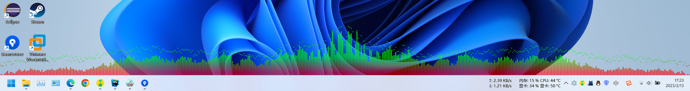
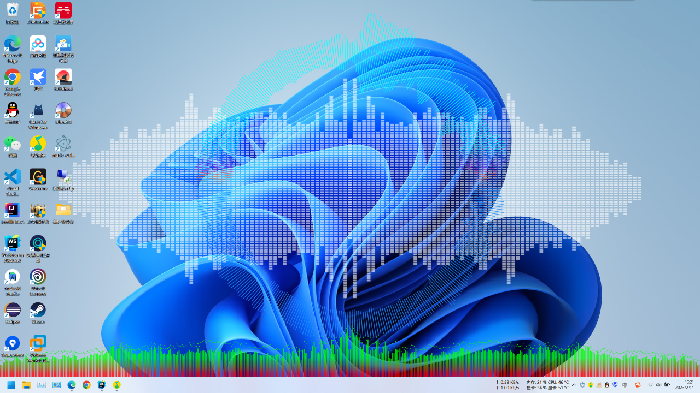

# music-wallpaper

#### 介绍
基于Electron开发的桌面插件，将系统音频可视化显示在桌面壁纸上

备用仓库：https://gitee.com/CrimsonHu/music-wallpaper

网络原因，使用gitee发布release，需要获取Windows上打包的可执行文件访问上述链接即可

#### 实现过程
1.  通过Windows API实现将Electron界面嵌入到桌面图标层与壁纸层之间
2.  通过Electron提供的接口抓取系统音频，放入AudioContext中
3.  在Cnavas上显示音频可视化效果

#### 代码运行方法
1.  需要C++编译环境（建议安装Visual Studio）
2.  拉取代码，执行npm install
3.  执行npm run gyp-rebuild，编译native目录下的attach.cpp
4.  执行npm run start，即可运行代码

#### 打包方法
1.  npm run package-build:win

#### 图片展示

